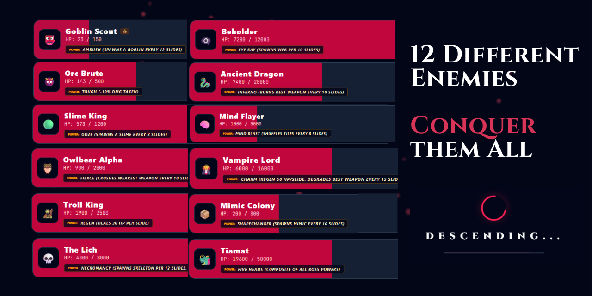

<div align="center">

#  🐉 CRIT 2048 🐉

### _A D&D Inspired 2048 Roguelike Dungeoncrawler_

[](LICENSE)
[](https://react.dev/)
[](https://threejs.org/)
[](https://www.dndbeyond.com/)

> _"Every slide is a swing. Every merge is a kill. Roll the d20 - and pray."_

</div>

---

[](https://denzven.github.io/Crit2048-DZVN/)

## 🎲 What is Crit 2048?

**Crit 2048** is a **roguelike dungeon crawler** built on the foundation of the classic 2048 sliding puzzle. Instead of chasing a number, you are a **D&D adventurer** fighting your way through a **twelve-boss dungeon** with nothing but your wits, a 4×4 grid of weapons, and a twenty-sided die.

Inspired by the **deck-building chaos of Balatro** and the **tactical depth of D&D 5e (2024 edition)**, every run is shaped by class selection, artifact acquisitions, critical hit luck, and boss abilities. The game is now **100% data-driven**, allowing for infinite expansion through custom content packs via **The Forge**.

---

## 🗺️ Core Concept

The 2048 grid is your **battlefield**. Tiles represent weapons - sliding two matching weapons together **merges** them into a more powerful weapon and deals **damage** to the boss. When the boss hits zero HP, you advance. If your slides run out first, the dungeon claims your soul.

```
Dagger (2) + Dagger (2)   = Longsword  (4)    ->  8 dmg
Longsword  + Longsword    = Crossbow   (8)    ->  20 dmg
Crossbow   + Crossbow     = Battleaxe  (16)   ->  50 dmg
Battleaxe  + Battleaxe    = Magic Staff(32)   ->  120 dmg
Magic Staff + Magic Staff = Holy Sword (64)   ->  300 dmg
Holy Sword + Holy Sword   = Relic      (128+) ->  val x 10 dmg
```

Every merge deals `weapon_base_dmg x your_multiplier` damage. The multiplier is the engine that makes everything scale - build it up, and a single merge can delete an Ancient Dragon.

---

## 🧪 Game Loop

```
START -> CLASS SELECT -> ENCOUNTER (Ante 1-12) -> TAVERN -> -> -> FINAL BOSS (Ante 12) -> VICTORY
                                 [D20 Roll]           [Buy Artifacts]
                                      ^                     v
                                 [Spell Cast]          [Upgrade Spells]
```

1. **Choose your Class** - each class changes your modifiers, gold generation, and grants a unique spell.
2. **Fight the Boss** - slide tiles on the grid to merge weapons and deal damage. You have a limited number of slides per boss (the "Ante").
3. **Roll the D20** - every 5 slides, you are interrupted by a mandatory D20 roll. The outcome can be devastating or divine.
4. **Use your Spell** - if your class has one, activate it anytime during combat.
5. **Visit the Tavern** - after each boss kill, spend gold on artifacts that permanently alter your run.
6. **Descend** - repeat until you conquer all 12 bosses, or the grid locks.

---

## ⚔️ Classes


Each class is built around one D&D 5e archetype and plays distinctly differently:

| Icon | Class         | D20 Mod | Passive Ability                                      | Class Spell                                                                     |
| ---- | ------------- | ------- | ---------------------------------------------------- | ------------------------------------------------------------------------------- |
| 😡   | **Barbarian** | -1      | +10 damage to Dagger & Longsword merges (T1 & T2)    | **Rage** - Roll 1d12. Massive stomp damage.                                     |
| 🥷   | **Rogue**     | +2      | +1 Gold per every merge                              | **Sneak Attack** - Roll 2d6. Precise lethal strike.                             |
| 🧙‍♂️   | **Wizard**    | +1      | -                                                    | **Fireball** - Roll 1d6 \* Mult. Burns a 2x2 tile zone.                         |
| 👁️   | **Warlock**   | +1      | -                                                    | **Eldritch Blast** - Roll 1d10 \* Mult. Clears an entire row of hazard tiles.   |
| ✨   | **Cleric**    | 0       | -                                                    | **Divine Aid** - Roll 1d8. Restores that many slides. Purifies one hazard tile. |
| 🛡️   | **Paladin**   | 0       | -                                                    | **Divine Smite** - Roll 1d8 \* your highest weapon tile. Enormous spike damage. |
| 🎵   | **Bard**      | +1      | +5 Gold generated on every D20 roll                  | **Vicious Mockery** - Roll 1d6 \* Mult.                                         |
| 🌿   | **Druid**     | 0       | 20% chance to purify a hazard automatically on slide | **Entangle** - Roll 1d6. Destroys lowest active tile.                           |
| ⚔️   | **Fighter**   | 0       | +15 damage to merges of Tier 3+ (Crossbow and above) | **Action Surge** - Grants massive base damage bonus.                            |
| 👊   | **Monk**      | +1      | Alternating directions on slides builds Mult bonus   | **Flurry of Blows** - Roll 3d4. Fast and lethal.                                |
| 🏹   | **Ranger**    | -1      | Deal +25% damage to bosses that spawn hazards        | **Hunter's Mark** - Next merge deals 2x damage.                                 |
| 🔮   | **Sorcerer**  | +1      | D20 rolls of 19 act as Critical Hits                 | **Chaos Bolt** - Roll 1d12 \* Mult.                                             |

---

## 🐉 The Twelve Bosses (Antes)



| Ante | Boss                  | HP     | Slides | Special Power                                                          |
| ---- | --------------------- | ------ | ------ | ---------------------------------------------------------------------- |
| 1    | 👺 **Goblin Scout**   | 150    | 25     | **Ambush** - Spawns a Goblin tile every 12 slides.                     |
| 2    | 👹 **Orc Brute**      | 500    | 30     | **Tough** - All damage you deal is reduced by 10%.                     |
| 3    | 📦 **Mimic Colony**   | 800    | 30     | **Shapechanger** - Spawns Mimic tiles that block merges.               |
| 4    | 🟢 **Slime King**     | 1,200  | 35     | **Ooze** - Spawns a Slime tile every 8 slides.                         |
| 5    | 🦉 **Owlbear Alpha**  | 2,000  | 35     | **Frenzy** - High HP, forces careful slide economy.                    |
| 6    | 🧌 **Troll King**     | 3,500  | 40     | **Regen** - Heals 30 HP after every single slide you make.             |
| 7    | 🧠 **Mind Flayer**    | 5,000  | 35     | **Mind Blast** - Periodically shuffles your tiles.                     |
| 8    | 💀 **The Lich**       | 8,000  | 30\*   | **Necromancy** - Spawns Skeletons. Starts with 10 fewer slides.        |
| 9    | 👁️‍🗨️ **Beholder**       | 12,000 | 40     | **Eye Ray** - Shoots Web tiles that block and require damage to clear. |
| 10   | 🐉 **Ancient Dragon** | 20,000 | 45     | **Inferno** - Burns your highest-value weapon tile every 10 slides.    |
| 11   | 🧛 **Vampire Lord**   | 16,000 | 40     | **Charm** - Degrades your best weapons and heals itself rapidly.       |
| 12   | 🐲 **Tiamat**         | 50,000 | 50     | **Chromatic Wrath** - Unleashes ALL other boss powers simultaneously.  |

---

## 🤝 Challenge Your Friends


Crit 2048 features deep **social integration**. After any encounter, you can generate a **Challenge Link** to send to friends. This captures your exact grid state, multiplier, and artifacts, allowing others to try and beat your high score or survive a specific boss encounter.

---

## 🎲 The D20 System

The D20 is the heartbeat of **Crit 2048**'s roguelike identity. Every **5 slides**, the game pauses for a mandatory D20 roll - rendered as a fully animated **3D physics-based die** using Three.js.


| Roll Result     | Outcome                                    |
| --------------- | ------------------------------------------ |
| 20+ (Nat 20)    | CRITICAL HIT - Mult +1 & upgrade a tile    |
| 10-19 (Success) | SUCCESS - A Crossbow tile spawns           |
| 2-9 (Miss)      | MISS - A Slime tiles spawns                |
| 1 (Nat 1)       | CRITICAL FAILURE - Your best weapon breaks |

Your **class modifier** applies to every roll:

- Rogue gets +2 (consistently succeeds), Barbarian gets -1 (lives dangerously)
- The **Amulet of Proof** artifact sets a minimum roll floor of 5

---

## 🍺 The Tavern (Between-Boss Shop)

After defeating each boss (except the last), you are transported to the **Tavern** — a shop where you spend your hard-earned gold on magical artifacts. The shop randomly offers **4 items** from the master pool.

### Artifact Catalog

| Icon | Artifact                | Rarity    | Effect                           |
| ---- | ----------------------- | --------- | -------------------------------- |
| 📿   | **Amulet of Proof**     | Rare      | D20 floor protection (Min 5).    |
| 💍   | **Ring of Wealth**      | Rare      | +30 Gold entering Tavern.        |
| 🥾   | **Gravity Boots**       | Common    | Sliding DOWN deals bonus damage. |
| 📖   | **Necronomicon**        | Legendary | Slimes damage the boss.          |
| 🧪   | **Giant's Potion**      | Rare      | Permanent Mult bonus.            |
| 🔪   | **Vorpal Edge**         | Legendary | Chance for massive True Damage.  |
| 🃏   | **Deck of Many Things** | Artifact  | D20 outcomes are doubled.        |

---

## 🤖 The Gemini Oracle

A unique feature powered by **Google's Gemini AI**. Spend 50 gold in the Tavern to consult the Oracle - it generates a **one-of-a-kind, flavor-rich legendary artifact** with a custom name and description, tailored to your current class and progress.

```json
{
  "name": "Chalice of the Fallen Paladin",
  "desc": "An ancient goblet that weeps silver tears. Grants +1.0 Multiplier."
}
```

---

## ⚒️ The Forge & Grimoire


Crit 2048 is 100% data-driven. The **Grimoire** tracks your discovered artifacts, while **The Forge** allows you to create and export your own content packs.

---

## 🎬 3D Physics Dice Engine

All dice in Crit 2048 — from the D20 to class spell rolls — are rendered using a fully custom **Three.js physics simulation**.

- **Physics**: Gravity, bounce, wall collisions, friction, and angular velocity — all simulated per-frame.
- **Deterministic**: Outcome is pre-seeded by the PRNG then animated. The die **always lands on the correct face**.
- **Toon shading**: Stylized, cel-shaded tabletop aesthetic.

---

## 🧠 Strategy Tips

- 🥷 **Rogue** scales hardest in long runs — every merge generates gold and Multiplier.
- 🛡️ **Paladin** is the single-turn burst king. Save Divine Smite for a Holy Sword tile.
- 📖 **Necronomicon** completely flips the Slime King fight.
- 🐉 Against the **Ancient Dragon**, prioritize merging quickly to avoid the Inferno.

---

## 🛠️ Tech Stack

| Technology                | Role                                      |
| ------------------------- | ----------------------------------------- |
| **React 19 / TypeScript** | Core game engine & component architecture |
| **Vite**                  | Build tool & HMR dev server               |
| **Tailwind CSS 4.0**      | Utility styling and design system         |
| **Three.js**              | 3D dice physics renderer                  |
| **Web Audio API**         | Procedural sound effects                  |
| **Gemini 3 Flash**        | AI Oracle artifact generation             |

---

## 📜 License

This project is licensed under the **MIT License**.

---

<div align="center">

_Built with equal parts dice rolls, merges, and chaos. May your multiplier be high and your Nat 1s be few._

**⚔️ Roll for initiative. ⚔️**

</div>
